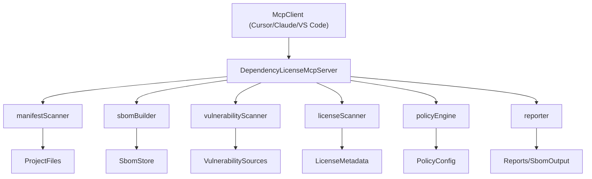
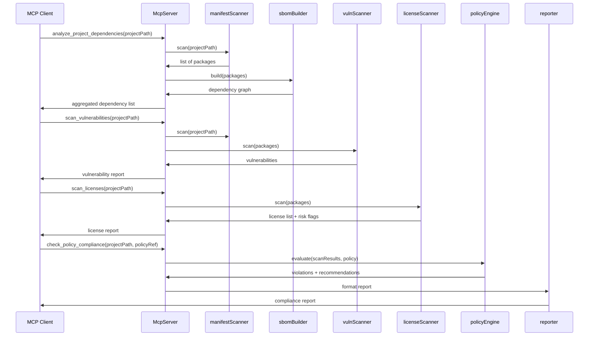

# Архитектура и API MCP-сервера «Инспектор зависимостей и лицензий»

Технический дизайн сервера: компоненты, потоки данных, инструменты, ресурсы и конфигурация.

---

## 1. Технологический стек

| Элемент | Выбор |
|--------|--------|
| **Язык** | Python (совместимость с текущим репозиторием, setup.py, src/) |
| **MCP SDK** | Официальный [Python MCP SDK](https://github.com/modelcontextprotocol/python-sdk) |
| **Транспорт** | stdio (локальный запуск); далее — опционально HTTP/Docker для удалённого доступа |
| **Зависимости** | Минимум внешних: парсинг манифестов (встроенный/легковесные библиотеки), запросы к OSV/npm/PyPI при необходимости |

---

## 2. Архитектура компонентов



### Роли компонентов

| Компонент | Назначение |
|-----------|------------|
| **manifest_scanner** | Обход директории проекта, поиск и парсинг файлов зависимостей (package.json, lock-файлы, requirements.txt, pyproject.toml, poetry.lock, pom.xml и т.д.). Выдача списка пакетов с версиями и экосистемой. |
| **sbom_builder** | Построение внутреннего графа зависимостей (direct + transitive) и при необходимости экспорт в SPDX/CycloneDX. |
| **vulnerability_scanner** | Вызов внешних источников (OSV API, npm audit, pip-audit, или обёртки Trivy) и агрегация результатов: CVE, severity, рекомендуемые версии. |
| **license_scanner** | Сбор лицензий из метаданных (package.json, PyPI, Maven Central) и при необходимости эвристики по файлам LICENSE/COPYING. Классификация (permissive, copyleft, unknown). |
| **policy_engine** | Загрузка политики (YAML/JSON): допустимые/запрещённые лицензии, минимальные версии, блокировка по CVE. Сравнение с результатами сканов и формирование отчёта о нарушениях. |
| **reporter** | Генерация отчётов: JSON (машиночитаемый), Markdown (для диалога с ИИ), SBOM (SPDX/CycloneDX). |

---

## 3. Поток данных



---

## 4. MCP Tools (инструменты)

**Соответствие требованиям к сущностям MCP:** каждый инструмент выполняет одну понятную операцию, имеет явную схему входных данных (параметры с типами и описаниями), возвращает предсказуемый формат результата (JSON с фиксированными полями) и не имеет скрытых побочных эффектов (кроме обновления сессионного состояния для Resources).

### 4.1. `analyze_project_dependencies`

**Назначение:** Построить агрегированный список зависимостей проекта (direct + transitive) по всем обнаруженным экосистемам.

**Вход:**

| Параметр | Тип | Обязательный | Описание |
|----------|-----|--------------|----------|
| `project_path` | string | да | Путь к корню проекта (директория). |
| `include_dirs` | array of string | нет | Поддиректории для включения (по умолчанию — все). |
| `exclude_dirs` | array of string | нет | Исключить из сканирования (например, node_modules, .venv, target). |

**Выход (структура):**

- Список пакетов с полями: `name`, `version`, `ecosystem` (npm/pypi/maven), `direct` (bool), `parent` (опционально, для транзитивных).
- Краткая сводка: количество по экосистемам, по direct/transitive.

**Реализация:** вызов `manifest_scanner`, затем `sbom_builder` для графа; возврат агрегированного списка и сводки.

---

### 4.2. `scan_vulnerabilities`

**Назначение:** Просканировать зависимости проекта на известные уязвимости и вернуть приоритизированный отчёт.

**Вход:**

| Параметр | Тип | Обязательный | Описание |
|----------|-----|--------------|----------|
| `project_path` | string | да | Путь к корню проекта. |
| `report_id` | string | нет | Если ранее вызывался анализ — опционально переиспользовать кэш по ID. |

**Выход:**

- Список записей: пакет, версия, CVE ID, severity (critical/high/medium/low), краткое описание, рекомендуемая версия, ссылка на детали.
- Сводка: количество по уровням серьёзности.

**Реализация:** при необходимости вызов `manifest_scanner`; вызов `vulnerability_scanner` (OSV API и/или npm audit, pip-audit и т.д.); агрегация и сортировка по severity.

---

### 4.3. `scan_licenses`

**Назначение:** Получить список лицензий всех зависимостей и флаги риска (copyleft, unknown, multiple).

**Вход:**

| Параметр | Тип | Обязательный | Описание |
|----------|-----|--------------|----------|
| `project_path` | string | да* | Путь к корню проекта. |
| `packages` | array | нет | Альтернатива: список `{name, version, ecosystem}` для проверки без полного скана. |

*Один из `project_path` или `packages` обязателен.

**Выход:**

- Список: пакет, версия, экосистема, лицензия (SPDX ID или строка), флаги: `is_copyleft`, `is_unknown`, `is_multiple`.
- Сводка: количество по категориям лицензий.

**Реализация:** при необходимости `manifest_scanner`; вызов `license_scanner` по метаданным и при необходимости по файлам в пакетах.

---

### 4.4. `check_policy_compliance`

**Назначение:** Проверить текущее состояние проекта (зависимости, уязвимости, лицензии) на соответствие заданной политике.

**Вход:**

| Параметр | Тип | Обязательный | Описание |
|----------|-----|--------------|----------|
| `project_path` | string | да | Путь к корню проекта. |
| `policy` | object или string | да | Политика: встроенный объект или путь к YAML/JSON. См. формат ниже. |

**Формат политики (минимальный):**

```yaml
allowed_licenses: ["MIT", "Apache-2.0", "BSD-3-Clause"]
denied_licenses: ["GPL-2.0", "AGPL-3.0"]
deny_unknown_license: true
block_critical_cve: true
block_high_cve: false
```

**Выход:**

- Флаг соответствия (да/нет).
- Список нарушений с типом (license, cve, unknown_license) и деталями.
- Рекомендации: какие пакеты заменить или обновить.

**Реализация:** последовательный вызов (или использование кэша) `analyze_project_dependencies`, `scan_vulnerabilities`, `scan_licenses`; загрузка политики в `policy_engine`;
сравнение и формирование отчёта через `reporter`.

---

### 4.5. `generate_sbom`

**Назначение:** Сгенерировать Software Bill of Materials в выбранном формате.

**Вход:**

| Параметр | Тип | Обязательный | Описание |
|----------|-----|--------------|----------|
| `project_path` | string | да | Путь к корню проекта. |
| `format` | string | да | `spdx` или `cyclonedx`. |

**Выход:**

- Содержимое SBOM (строка или вложение): SPDX JSON или CycloneDX JSON.

**Реализация:** вызов `manifest_scanner` и `sbom_builder`; экспорт в выбранный формат через `reporter` или отдельный модуль экспорта.

---

### 4.6. `suggest_dependency_replacements`

**Назначение:** Для заданных проблемных зависимостей (CVE или недопустимая лицензия) предложить альтернативы.

**Вход:**

| Параметр | Тип | Обязательный | Описание |
|----------|-----|--------------|----------|
| `packages` | array | да | Список объектов `{name, version, ecosystem, reason}` (reason: "cve" | "license"). |
| `policy` | object/string | нет | Политика лицензий для фильтрации допустимых замен. |

**Выход:**

- По каждому пакету: список альтернатив с полями: имя, рекомендуемая версия, лицензия, краткое обоснование (например, «без известных CVE», «допустимая лицензия»).

**Реализация:** запросы к регистрам (npm, PyPI, Maven Central) и/или OSV; фильтрация по политике; ранжирование (активность, популярность) и возврат списка.

---

## 5. MCP Resources

**Соответствие требованиям:** инженер определяет разрешённые источники (сессионное состояние последнего скана/отчёта), допустимые пути (URI ниже), ограничения по объёму и типу (JSON, лимиты CPU/RAM в runtime).

| URI / идентификатор | Описание |
|--------------------|----------|
| `report://latest` | Последний сгенерированный отчёт по проекту (если сервер хранит состояние последнего скана по project_path в сессии). |
| `sbom://{project_id}?format=spdx` | Сгенерированный SBOM в формате SPDX для проекта. |
| `sbom://{project_id}?format=cyclonedx` | Сгенерированный SBOM в формате CycloneDX. |

Реализация: при вызове `generate_sbom` или после полного анализа сервер может регистрировать ресурс с актуальным содержимым; клиент читает по URI.

---

## 6. MCP Prompts

**Соответствие требованиям:** шаблоны/инструкции, встроенные в сервер, для стандартизации операций (аудит зависимостей и рисков, отчёт по лицензиям для юриста). Клиент получает текст с рекомендуемой последовательностью вызовов tools и форматом ответа; LLM не вызывается внутри сервера.

| Имя | Описание | Использование |
|-----|----------|----------------|
| `audit_dependencies_and_risks` | Шаблон запроса: проанализировать зависимости проекта и предложить план устранения критичных рисков. | Подставляет project_path и вызывает инструменты анализа и проверки политики; ИИ интерпретирует результат. |
| `license_report_for_legal` | Шаблон: сформировать отчёт для юриста по лицензиям. | Вызывает `scan_licenses` и при необходимости `check_policy_compliance`; возвращает структурированные данные для формулировки текста отчёта. |

Внутри промптов — описание рекомендуемой последовательности вызовов tools (analyze_project_dependencies → scan_vulnerabilities → scan_licenses → check_policy_compliance) и формата ответа.

---

## 7. Конфигурация сервера

Рекомендуемые параметры (переменные окружения или конфиг-файл):

| Параметр | Описание | По умолчанию |
|----------|----------|--------------|
| `PROJECT_ROOT` | Корень проекта при запуске «в контексте» одного репо. | Не задан (передаётся в каждом вызове). |
| `POLICY_PATH` | Путь к файлу политики по умолчанию. | Не задан. |
| `OSV_API_BASE` | Базовый URL OSV API. | https://api.osv.dev |
| `ENABLE_NPM_AUDIT` | Вызывать ли npm audit для npm-проектов. | true |
| `ENABLE_PIP_AUDIT` | Вызывать ли pip-audit для Python-проектов. | true |
| `CACHE_TTL_SECONDS` | Время жизни кэша результатов сканирования (секунды). | 300 |
| `EXCLUDE_DIRS` | Список директорий, исключаемых из сканирования (через запятую). | node_modules,.venv,__pycache__,target,.git |

**Ограничения доступа MCP (безопасность):**

| Параметр | Описание | По умолчанию |
|----------|----------|--------------|
| `ALLOWED_BASE_PATH` | Если задан — все `project_path` должны находиться внутри этой директории. | Не задан. |
| `MAX_INPUT_PATH_LENGTH` | Максимальная длина пути (символов). | 4096 |
| `MAX_EXCLUDE_DIRS` | Максимальное число элементов в `exclude_dirs`. | 100 |
| `MAX_POLICY_PAYLOAD_BYTES` | Максимальный размер политики (байт): путь или JSON. | 524288 (512 KiB) |
| `TOOL_TIMEOUT_SECONDS` | Таймаут выполнения одного инструмента (с). 0 = отключено. | 120 |

Сервер не выполняет произвольные shell-команды; все операции — чтение файлов и HTTP-запросы (например, OSV API).

---

## 8. Минимальный набор интеграций для v1

- **Манифесты:** парсинг `package.json`, `package-lock.json`, `yarn.lock`, `pnpm-lock.yaml`; `requirements.txt`, `pyproject.toml`, `poetry.lock`; опционально `pom.xml`.
- **Уязвимости:** OSV API (универсальный); опционально вызов `npm audit` и `pip-audit` при наличии соответствующих менеджеров в окружении.
- **Лицензии:** чтение полей `license` / `licenses` из package.json; метаданные PyPI (API или парсинг); для Maven — поля лицензий из Maven Central.
- **Политика:** один YAML/JSON файл с правилами allowed/denied licenses и флагами block_critical_cve / block_high_cve.
- **SBOM:** экспорт в SPDX 2.3 JSON и CycloneDX 1.5 JSON по графу, построенному из манифестов.

---

## 9. Структура каталогов (рекомендуемая)

```
src/
  mcp_dep_license/
    __init__.py
    server.py           # Точка входа MCP, регистрация tools/resources/prompts
    tools/
      analyze.py        # analyze_project_dependencies
      vulnerabilities.py # scan_vulnerabilities
      licenses.py       # scan_licenses
      policy.py        # check_policy_compliance
      sbom.py          # generate_sbom
      replacements.py  # suggest_dependency_replacements
    core/
      manifest_scanner.py
      sbom_builder.py
      vulnerability_scanner.py
      license_scanner.py
      policy_engine.py
      reporter.py
    config.py
```

Файлы в `plan/` (документация) не входят в код; они уже описаны в общем плане.
