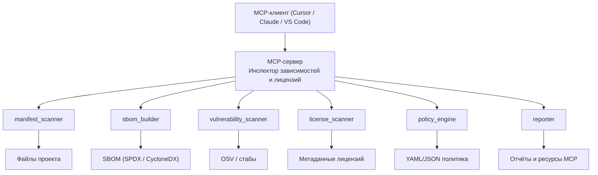

<script setup lang="ts">
import { computed, ref } from 'vue'

type PersonaId = 'dev' | 'sec' | 'legal'

const personas = [
  {
    id: 'dev' as PersonaId,
    title: 'Разработчик',
    need: 'Быстро понять состояние зависимостей и лицензий перед PR или релизом.',
    pains: [
      'Разные инструменты по языкам (npm audit, pip-audit, Maven плагины и т.д.)',
      'Непонятно, какая лицензия создаёт реальный риск для продукта',
      'Мало подсказок «что делать дальше» прямо в IDE / AI‑редакторе',
    ],
  },
  {
    id: 'sec' as PersonaId,
    title: 'Инженер по безопасности (AppSec / SecOps)',
    need: 'Полный аудит нового или унаследованного репозитория и проверка политики лицензий.',
    pains: [
      'Нужен единый отчёт по всему репозиторию, а не по одному языку',
      'Сложно приоритизировать CVE и отличать продакшен‑зависимости от dev',
      'Не всегда есть удобный доступ к CLI, зато есть доступ к ИИ‑инструментам',
    ],
  },
  {
    id: 'legal' as PersonaId,
    title: 'Юрист / Compliance',
    need: 'Понятный отчёт по лицензиям и рискам без технических деталей.',
    pains: [
      'Сырые отчёты SCA сложны для интерпретации',
      'Нужны краткие выводы и варианты действий (заменить / исключить / принять)',
      'Нужен перевод из SPDX‑идентификаторов в юридически значимые формулировки',
    ],
  },
]

const activePersonaId = ref<PersonaId>('dev')
const activePersona = computed(
  () => personas.find((p) => p.id === activePersonaId.value) ?? personas[0],
)

const toolImpact = [
  { name: 'analyze_project_dependencies', label: 'Граф зависимостей', value: 90 },
  { name: 'scan_vulnerabilities_tool', label: 'Скан уязвимостей', value: 85 },
  { name: 'scan_licenses_tool', label: 'Скан лицензий', value: 80 },
  { name: 'check_policy_compliance', label: 'Проверка политики', value: 75 },
  { name: 'generate_sbom_spdx / cyclonedx', label: 'SBOM', value: 70 },
  { name: 'suggest_dependency_replacements', label: 'Рекомендации по заменам', value: 65 },
]
</script>

<!-- Слайд 1. Проблема и цель -->

<style>
:global(.slide-title) {
  font-size: 24px;
  font-weight: 700;
  color: #e5e7eb;
  margin-bottom: 16px;
}

:global(.slide-subtitle) {
  font-size: 18px;
  font-weight: 600;
  color: #a5b4fc;
  margin-bottom: 12px;
}

:global(.text-error) {
  color: #f97373;
}

:global(.text-improvement) {
  color: #c084fc;
}
</style>

<h2 class="slide-title">Детерминированный MCP-сервер для инспекции зависимостей и лицензий</h2>

<div class="grid grid-cols-[1.4fr,1.6fr] gap-6 items-start">
  <div>
    <h3 class="text-base font-bold mb-3 text-emerald-300">Какую dev‑боль решает этот MCP?</h3>
    <ul class="space-y-1.5 text-[13px] leading-relaxed">
      <li>
        <strong>Разбросанные зависимости.</strong>
        Один проект — несколько экосистем (npm, PyPI и др.), нет единой «панели состояния».
      </li>
      <li>
        <strong>Лицензии и политика.</strong>
        Разные лицензии (GPL/AGPL/LGPL/SSPL) по‑разному влияют на продукт, риски неочевидны.
      </li>
      <li>
        <strong>Уязвимости и решения.</strong>
        SCA‑отчёты дают длинные списки CVE; приоритизация и план действий полностью на разработчике.
      </li>
    </ul>
  </div>
  <div>
    <h3 class="text-base font-bold mb-3 text-sky-300">Почему именно MCP‑сервер?</h3>
    <table class="text-xs border border-slate-700 rounded-lg w-full">
      <thead class="bg-slate-900/70">
        <tr>
          <th class="px-3 py-2 text-left w-1/3">Критерий</th>
          <th class="px-3 py-2 text-left">Решение через MCP</th>
        </tr>
      </thead>
      <tbody>
        <tr class="border-t border-slate-800">
          <td class="px-3 py-2 font-semibold">Единая точка входа</td>
          <td class="px-3 py-2">
            Один MCP‑сервер обслуживает запросы из Cursor, Claude Code, VS Code и других клиентов
          </td>
        </tr>
        <tr class="border-t border-slate-800">
          <td class="px-3 py-2 font-semibold">Формат для ИИ</td>
          <td class="px-3 py-2">
            Результаты — структурированные JSON/SBOM‑данные, удобные для анализа ИИ‑ассистентом
          </td>
        </tr>
        <tr class="border-t border-slate-800">
          <td class="px-3 py-2 font-semibold">Детерминизм</td>
          <td class="px-3 py-2">
            Ядро без LLM: только парсинг, сканирование, политика и стабы в DEMO_MODE
          </td>
        </tr>
        <tr class="border-t border-slate-800">
          <td class="px-3 py-2 font-semibold">Повторяемость</td>
          <td class="px-3 py-2">
            Поведение описано в планах <code>plan/01–06</code>, Docker‑контракте и DEMO‑сценарии
          </td>
        </tr>
      </tbody>
    </table>
  </div>
</div>

---

<!-- Слайд 2. Целевые пользователи -->

<h2 class="slide-title">Для кого этот MCP‑сервер?</h2>

<table class="text-[11px] border border-slate-700 rounded-lg w-full mb-4">
  <thead class="bg-slate-900/80">
    <tr>
      <th class="px-3 py-2 text-left w-1/5">Специальность</th>
      <th class="px-3 py-2 text-left w-2/5">Потребность</th>
      <th class="px-3 py-2 text-left">Боли</th>
    </tr>
  </thead>
  <tbody>
    <tr class="border-t border-slate-800">
      <td class="px-3 py-2 font-semibold">Разработчик</td>
      <td class="px-3 py-2">
        Быстро проверить проект на уязвимости и лицензии перед PR/релизом
      </td>
      <td class="px-3 py-2">
        Разные инструменты по языкам; непонятно, какая лицензия создаёт риск; мало подсказок
        «что делать дальше» в IDE/AI‑редакторе
      </td>
    </tr>
    <tr class="border-t border-slate-800">
      <td class="px-3 py-2 font-semibold">Инженер AppSec</td>
      <td class="px-3 py-2">
        Быстрый аудит нового или унаследованного репозитория: MCP строит граф зависимостей, сканирует уязвимости и лицензии, проверяет политику и выдаёт приоритизированный отчёт
      </td>
      <td class="px-3 py-2">
        Нужен единый отчёт по всему репо; важно отличать продакшен‑зависимости от dev;
        не всегда есть удобный доступ к CLI
      </td>
    </tr>
    <tr class="border-t border-slate-800">
      <td class="px-3 py-2 font-semibold">Юрист / Compliance</td>
      <td class="px-3 py-2">
        Короткий отчёт по лицензиям и рискам без технических деталей. MCP возвращает структурированные данные, а ИИ формирует краткий текст с рисками и вариантами действий.
      </td>
      <td class="px-3 py-2">
        Сырые SCA‑отчёты сложны; нужны краткие выводы и варианты действий (заменить / исключить / принять)
      </td>
    </tr>
  </tbody>
</table>

<p class="text-[12px] leading-relaxed text-improvement">
  <strong>MCP‑сервер выступает мостом между сырыми SCA‑данными и осмысленными рекомендациями:
  он собирает граф зависимостей, уязвимости, лицензии и результаты проверки политики,
  чтобы ИИ‑ассистент мог отвечать разработчикам, безопасникам и юристам на одном языке</strong>
</p>

---

<!-- Слайд 3. Схема агентной системы -->

<h2 class="slide-title">Архитектура MCP‑сервера (упрощённо)</h2>

<div class="scale-[0.9] origin-top mx-auto">

</div>

<div class="grid grid-cols-2 gap-8 -mt-2 text-xs leading-relaxed">
  <div>
    <h3 class="text-base font-bold mb-1 text-emerald-300">6 инструментов:</h3>
    <ul class="space-y-1">
      <li><strong class="text-improvement">manifest_scanner</strong> — находит манифесты и строит список пакетов</li>
      <li><strong class="text-improvement">sbom_builder</strong> — строит граф зависимостей и экспортирует SBOM</li>
      <li><strong class="text-improvement">vulnerability_scanner</strong> — агрегирует уязвимости из OSV или стабов</li>
      <li><strong class="text-improvement">license_scanner</strong> — собирает лицензии и помечает рисковые</li>
      <li><strong class="text-improvement">policy_engine</strong> — сравнивает результаты с политикой компании</li>
      <li><strong class="text-improvement">reporter</strong> — формирует JSON/Markdown‑отчёты и ресурсы для MCP Inspector</li>
    </ul>
  </div>
  <div>
    <h3 class="mb-1 text-base font-bold mb-3 text-sky-300">2 промпта:</h3>
    <ul class="space-y-1">
      <li><strong class="text-improvement">audit_dependencies_and_risks</strong> — аудит зависимостей и рисков: цепочка analyze → scan_vulnerabilities → scan_licenses → check_policy_compliance с краткой сводкой и планом действий</li>
      <li><strong class="text-improvement">license_report_for_legal</strong> — отчёт по лицензиям для юриста: акцент на типах лицензий, нарушениях политики и рекомендуемых шагах</li>
    </ul>
  </div>
</div>

---

<!-- Слайд 4. Агенты и их роли -->

<h2 class="slide-title">Схема агентной системы – роли</h2>

<p class="text-[12px] leading-relaxed mb-3">
  Для оркестрации этих агентов и выбора последовательности их вызовов использовался LLM‑оркестратор
  <span class="text-improvement"><strong>Claude Sonnet 4.6</strong></span>, а сами решения фиксировались в планах и документации репозитория.
</p>

<style>
:global(.agent-roles-table th),
:global(.agent-roles-table td) {
  padding-top: 0.5rem !important;
  padding-bottom: 0.5rem !important;
}
</style>

<table class="agent-roles-table text-[9px] border border-slate-700 rounded-lg w-full">
  <thead class="bg-slate-900/80">
    <tr>
      <th class="px-1.5 py-1 text-left">Роль агента</th>
      <th class="px-1.5 py-1 text-left">Зона ответственности</th>
      <th class="px-1.5 py-1 text-left">Инструменты / файлы</th>
    </tr>
  </thead>
  <tbody>
    <tr class="border-t border-slate-800">
      <td class="px-1.5 py-1 font-semibold">PM Agent / Orchestrator</td>
      <td class="px-1.5 py-1">Постановка задач по шагам плана, управление цепочками агентов</td>
      <td class="px-1.5 py-1"><code>plan/</code>, формулировки задач в чате, системные инструкции для цепочек</td>
    </tr>
    <tr class="border-t border-slate-800">
      <td class="px-1.5 py-1 font-semibold">Dev</td>
      <td class="px-1.5 py-1">Ядро MCP‑сервера, scanners, policy_engine, ресурсы</td>
      <td class="px-1.5 py-1"><code>server.py</code>, <code>core/</code>, сигнатуры tools/resources</td>
    </tr>
    <tr class="border-t border-slate-800">
      <td class="px-1.5 py-1 font-semibold">QA</td>
      <td class="px-1.5 py-1">Автотесты, фикстуры, проверка DEMO‑сценария</td>
      <td class="px-1.5 py-1"><code>tests/</code>, <code>tests/fixtures/</code>, <code>DEMO.md</code></td>
    </tr>
    <tr class="border-t border-slate-800">
      <td class="px-1.5 py-1 font-semibold">Docs</td>
      <td class="px-1.5 py-1">Документация и демо‑сценарии</td>
      <td class="px-1.5 py-1"><code>README</code>, <code>DEMO.md</code>, презентации</td>
    </tr>
    <tr class="border-t border-slate-800">
      <td class="px-1.5 py-1 font-semibold">Deploy</td>
      <td class="px-1.5 py-1">Docker‑контракт и entrypoint</td>
      <td class="px-1.5 py-1"><code>Dockerfile</code>, команды <code>serve</code>/<code>smoke</code></td>
    </tr>
    <tr class="border-t border-slate-800">
      <td class="px-1.5 py-1 font-semibold">Security / Compliance</td>
      <td class="px-1.5 py-1">Политики, отсутствие секретов, ограничения по .cursorrules</td>
      <td class="px-1.5 py-1"><code>.cursorrules</code>, <code>check_policy_compliance</code></td>
    </tr>
    <tr class="border-t border-slate-800">
      <td class="px-1.5 py-1 font-semibold">Lint</td>
      <td class="px-1.5 py-1">Стиль и типы кода, качество Markdown</td>
      <td class="px-1.5 py-1">ruff, mypy, markdownlint</td>
    </tr>
    <tr class="border-t border-slate-800">
      <td class="px-1.5 py-1 font-semibold">API</td>
      <td class="px-1.5 py-1">Контракт инструментов и ресурсов MCP</td>
      <td class="px-1.5 py-1"><code>plan/05-architecture-and-api.md</code>, описания tools/resources</td>
    </tr>
    <tr class="border-t border-slate-800">
      <td class="px-1.5 py-1 font-semibold">Git</td>
      <td class="px-1.5 py-1">Аккуратные коммиты и история</td>
      <td class="px-1.5 py-1">Сообщения коммитов, диффы</td>
    </tr>
    <tr class="border-t border-slate-800">
      <td class="px-1.5 py-1 font-semibold">Verifier</td>
      <td class="px-1.5 py-1">Финальная сверка с планом и чек‑листами</td>
      <td class="px-1.5 py-1"><code>plan/06-implementation-plan.md</code>, smoke, pytest</td>
    </tr>
    <tr class="border-t border-slate-800">
      <td class="px-1.5 py-1 font-semibold">Debugger</td>
      <td class="px-1.5 py-1">Разбор падений тестов и ошибок Inspector</td>
      <td class="px-1.5 py-1">Логи pytest, сообщения MCP Inspector</td>
    </tr>
  </tbody>
</table>

---

<!-- Слайд 5. Процесс работы: этапы -->

<h2 class="slide-title">Процесс работы - этапы по составленному плану</h2>

<table class="text-[11px] border border-slate-700 rounded-lg w-full">
  <thead class="bg-slate-900/80">
    <tr>
      <th class="px-3 py-2 text-left w-10">№</th>
      <th class="px-3 py-2 text-left w-1/3">Этап</th>
      <th class="px-3 py-2 text-left">Суть</th>
    </tr>
  </thead>
  <tbody>
    <tr class="border-t border-slate-800">
      <td class="px-3 py-2 font-semibold">1</td>
      <td class="px-3 py-2">Анализ домена</td>
      <td class="px-3 py-2">
        Боли, сценарии и персоны по <code>plan/01-domain-and-user-needs.md</code>
      </td>
    </tr>
    <tr class="border-t border-slate-800">
      <td class="px-3 py-2 font-semibold">2</td>
      <td class="px-3 py-2">Архитектура MCP</td>
      <td class="px-3 py-2">
        Компоненты, инструменты и форматы в <code>plan/05-architecture-and-api.md</code>
      </td>
    </tr>
    <tr class="border-t border-slate-800">
      <td class="px-3 py-2 font-semibold">3</td>
      <td class="px-3 py-2">План реализации</td>
      <td class="px-3 py-2">
        Шаги и нефункциональные требования в <code>plan/06-implementation-plan.md</code>
      </td>
    </tr>
    <tr class="border-t border-slate-800">
      <td class="px-3 py-2 font-semibold">4</td>
      <td class="px-3 py-2">Реализация</td>
      <td class="px-3 py-2">
        Код MCP‑сервера, ядро, Docker‑контракт, ресурсы и инструменты
      </td>
    </tr>
    <tr class="border-t border-slate-800">
      <td class="px-3 py-2 font-semibold">5</td>
      <td class="px-3 py-2">Тестирование и DEMO</td>
      <td class="px-3 py-2">
        pytest, smoke‑проверка, прогон <code>DEMO.md</code> через MCP Inspector
      </td>
    </tr>
    <tr class="border-t border-slate-800">
      <td class="px-3 py-2 font-semibold">6</td>
      <td class="px-3 py-2">Валидация и доработки</td>
      <td class="px-3 py-2">
        Исправление ошибок, улучшение UX, обновление планов и документации
      </td>
    </tr>
    <tr class="border-t border-slate-800">
      <td class="px-3 py-2 font-semibold">7</td>
      <td class="px-3 py-2">Следующие шаги развития</td>
      <td class="px-3 py-2">
        Резюме продукта, варианты README, расширение DEMO, FAQ, презентация, вопросы жюри, roadmap и позиционирование — <code>plan/07-next-steps.md</code>
      </td>
    </tr>
  </tbody>
</table>

<p class="mt-3 text-[12px] leading-relaxed">
  <span class="text-improvement"><strong>Внутри каждого этапа человек уточнял следующий шаг по плану, а агенты исполняли его короткими циклами.</strong></span>
  <br>
  <span class="text-[11px]">
    Изменение кода
    <span class="text-slate-400">→</span>
    Тесты / DEMO
    <span class="text-slate-400">→</span>
    Обновление планов и документации
  </span>
</p>

---

<!-- Слайд 6. Процесс работы: роли и решения -->

<h2 class="slide-title">Процесс работы - кто за что отвечал</h2>

<div class="grid grid-cols-2 gap-6 text-[13px] leading-relaxed">
  <div>
    <h3 class="text-base font-bold mb-3 text-emerald-300">Человек</h3>
    <ul class="space-y-1.5">
      <li><strong>Формулировал цели</strong> и приоритизировал боли пользователей</li>
      <li><strong>Выбирал архитектуру</strong> и стек (Python MCP SDK, SBOM‑форматы)</li>
      <li><strong>Уточнял требования</strong> к UX DEMO и Inspector</li>
      <li><strong>Проводил ревью</strong> ключевых изменений и документации</li>
      <li><strong>Принимал финальные решения</strong> при расхождениях и неопределённости</li>
    </ul>
  </div>
  <div>
    <h3 class="text-base font-bold mb-3 text-sky-300">Агенты</h3>
    <ul class="space-y-1.5">
      <li>Реализовывали инструменты по контрактам из <code>plan/05-architecture-and-api.md</code></li>
      <li>Собирали MCP‑сервер пошагово по плану и обновляли чек‑листы в <code>plan/06-implementation-plan.md</code></li>
      <li>Обновляли README, DEMO.md и код под Docker‑контракт</li>
      <li>Исправляли ошибки (resources, summary, packages) по логам MCP Inspector</li>
    </ul>
  </div>
</div>

<h2 class="slide-title" style="margin-bottom: 4px;">Точки принятия решений</h2>
<p class="text-xs leading-relaxed text-improvement" style="margin-bottom: 0;">
  <strong>Фиксировались через планы и .cursorrules,
  поэтому процесс выглядел как движение по спецификации, а не как серия спонтанных промптов.</strong>
</p>
<ul class="text-[11px] leading-relaxed space-y-1">
  <li><strong>Детерминизм ядра.</strong> Только детерминированные сканеры и политика; LLM — только снаружи, внешние сервисы (OSV) всегда имеют стабы в <code>DEMO_MODE=true</code></li>
  <li><strong>Фиксированный набор tools.</strong> 6 основных инструментов и ресурсы из <code>plan/05-architecture-and-api.md</code>, единые контракты ввода/вывода</li>
  <li><strong>Архитектура и Docker‑контракт.</strong> Структура <code>src/mcp_dependency_inspector/</code>, команды <code>serve</code>/<code>smoke</code>, образ &le; 500&nbsp;МБ и лимиты CPU 2.0 / RAM 2048 MB</li>
  <li><strong>Безопасность и лицензии.</strong> Запрет секретов в репо, <code>.env.example</code>, формальная политика лицензий + tool <code>check_policy_compliance</code></li>
  <li><strong>Тестируемость и DEMO.</strong> Покрытие ключевых сценариев фикстурами и smoke‑тестами так, чтобы <code>DEMO.md</code> выполнялся целиком без платных сервисов</li>
</ul>

---

<!-- Слайд 7. MCP-серверы и инструменты -->

<h2 class="slide-title">Инструменты, на которых собран MCP‑сервер</h2>

<div class="grid grid-cols-[1.3fr,1.7fr] gap-8 items-start text-xs leading-relaxed">
  <div class="space-y-3">
    <div>
      <p class="text-base font-bold mt-0 mb-1.5 text-emerald-300" style="margin-top: 0;">Ядро и стек:</p>
      <ul class="space-y-1 mt-0">
        <li>Python 3.11+, <code>mcp</code>-SDK (stdio‑протокол)</li>
        <li>Pydantic для валидации схем и контрактов tools/resources</li>
        <li><code>tomli</code>, <code>ruamel.yaml</code> для разбора манифестов и политик</li>
        <li><code>httpx</code> для обращения к OSV с заглушками в <code>DEMO_MODE=true</code></li>
      </ul>
    </div>
    <div>
      <p class="text-base font-bold mt-0 mb-1.5 text-emerald-300" style="margin-top: 0;">Инфраструктура и качество:</p>
      <ul class="space-y-1">
        <li>Docker + многостадийный <code>Dockerfile</code> (образ &le; 500&nbsp;MB, команды <code>serve</code>/<code>smoke</code>)</li>
        <li>pytest, фикстуры в <code>tests/fixtures/</code>, smoke‑прогоны через MCP Inspector</li>
        <li>ruff, mypy, <code>.cursorrules</code> для стиля, типов и детерминизма</li>
        <li>Планирование через файлы <code>plan/01–06</code> и README/DEMO для воспроизводимости</li>
      </ul>
    </div>
    <div>
      <p class="text-base font-bold mt-0 mb-1.5 text-sky-300" style="margin-top: 0;">Агентные навыки и инструкции:</p>
      <ul class="space-y-1">
        <li><strong class="text-improvement">Skill «Dev MCP‑server engineer»</strong> — реализация ядра, scanners и policy‑engine по спецификации</li>
        <li><strong class="text-improvement">Skill «Security &amp; Compliance Reviewer»</strong> — проверка политики лицензий и отсутствия секретов</li>
        <li><strong class="text-improvement">Skill «Docs &amp; DEMO Writer»</strong> — структурирование README, DEMO.md и этой презентации</li>
      </ul>
    </div>
  </div>
  <div class="space-y-3 text-[11px]">
    <div>
      <p class="slide-subtitle">Примеры промптов и системных инструкций</p>
      <ul class="space-y-1">
        <li>• «Спроектируй детерминированный MCP‑сервер для инспекции зависимостей и лицензий на Python 3.11 с ядром без LLM. Используй Pydantic‑модели для всех входов/выходов tools и учти требования из <code>.cursorrules</code>.»</li>
        <li>• «Сгенерируй список MCP‑tools (analyze, scan, check, generate), задокументируй их контракты в <code>plan/05-architecture-and-api.md</code> и предложи структуру модулей в <code>src/mcp_dependency_inspector/</code>.»</li>
        <li>• «На основе DEMO‑сценария опиши smoke‑команды Docker‑образа и добавь проверки в <code>plan/06-implementation-plan.md</code>. Не меняй поведение tools, только фиксируй шаги проверки.»</li>
      </ul>
    </div>
    <div>
      <p class="slide-subtitle">Как агенты помогали при реализации</p>
      <ul class="space-y-1">
        <li>• Dev‑агент разбивал работу на небольшие коммиты: парсинг манифестов, построение SBOM, интеграция OSV‑сканера.</li>
        <li>• Git‑агент следил за чистой историей и понятными сообщениями коммитов по шагам плана.</li>
        <li class="text-improvement">• QA‑ и Verifier‑агенты превращали найденные баги в отдельные тесты и чек‑листы, чтобы ошибки не возвращались.</li>
      </ul>
    </div>
  </div>
</div>

---

<!-- Слайд 8. Контроль качества -->

<h2 class="slide-title">Контроль качества: проверка поддержки контрактов</h2>

<table class="text-[11px] border border-slate-700 rounded-lg w-full mb-3">
  <thead class="bg-slate-900/80">
    <tr>
      <th class="px-3 py-2 text-left">Механизм</th>
      <th class="px-3 py-2 text-left">Что проверяет</th>
      <th class="px-3 py-2 text-left">Где зафиксировано</th>
    </tr>
  </thead>
  <tbody>
    <tr class="border-t border-slate-800">
      <td class="px-3 py-2 font-semibold">Чек‑листы плана</td>
      <td class="px-3 py-2">Завершённость шагов и нефункциональных требований</td>
      <td class="px-3 py-2"><code>plan/06-implementation-plan.md</code></td>
    </tr>
    <tr class="border-t border-slate-800">
      <td class="px-3 py-2 font-semibold">Тесты</td>
      <td class="px-3 py-2">
        Корректность MCP‑tools и ядра без LLM и платных API
        (юнит‑ и интеграционные тесты)
      </td>
      <td class="px-3 py-2"><code>pytest</code>, интеграционные тесты MCP</td>
    </tr>
    <tr class="border-t border-slate-800">
      <td class="px-3 py-2 font-semibold">Линтеры</td>
      <td class="px-3 py-2">Стиль, типы, качество документации</td>
      <td class="px-3 py-2">ruff, mypy, markdownlint</td>
    </tr>
    <tr class="border-t border-slate-800">
      <td class="px-3 py-2 font-semibold">Smoke‑проверки</td>
      <td class="px-3 py-2">
        Контейнер собирается, стартует и отдаёт <code>/health</code> и <code>/mcp</code>
      </td>
      <td class="px-3 py-2"><code>docker run IMAGE smoke</code>, <code>serve</code></td>
    </tr>
    <tr class="border-t border-slate-800">
      <td class="px-3 py-2 font-semibold">Ручное DEMO</td>
      <td class="px-3 py-2">
        Сценарий в DEMO.md полностью воспроизводим в MCP Inspector
      </td>
      <td class="px-3 py-2"><code>DEMO.md</code>, MCP Inspector</td>
    </tr>
  </tbody>
</table>

<p class="text-[11px] leading-relaxed text-improvement" style="margin-bottom: 0;">
  <strong>Сводка по проверкам и тестам:</strong>
</p>
<ul class="text-[11px] leading-relaxed space-y-0.5">
  <li><strong>8 файлов тестов</strong> и <strong>136 pytest‑кейсов</strong> в сумме</li>
  <li><strong>120 юнит‑тестов</strong> для сканеров манифестов, уязвимостей, лицензий, <code>policy_engine</code>, <code>sbom_builder</code>, <code>reporter</code></li>
  <li><strong>16 интеграционных тестов</strong> для связки MCP‑tools и типичного DEMO‑пути</li>
  <li>Smoke‑путь: <code>docker run IMAGE smoke</code> + запуск <code>serve</code>, отдельный прогон сценария из <code>DEMO.md</code> через MCP Inspector</li>
  <li>
    Ошибки вида
    <span class="text-error">
      <code>contents must be str, bytes, or list[ResourceContent], got dict</code>,
      нестандартный формат <code>packages</code>
    </span>
    превращались в отдельные кейсы и исправлялись в коде, тестах и документации, а не «подкручивались» промптами
  </li>
</ul>

---

<!-- Слайд 9. Выводы -->

<h2 class="slide-title">Выводы - что сработало, а что нет</h2>

<div class="grid grid-cols-3 gap-4 text-[11px] leading-relaxed">
  <div class="rounded-xl border border-emerald-500/60 bg-emerald-900/30 px-3 py-2">
    <h3 class="slide-subtitle" style="font-size: 1.25rem !important; color: #6ee7b7 !important;">Что сработало</h3>
    <ul class="space-y-1.5">
      <li>Жёсткая опора на планы и архитектуру (<code>plan/01–06</code>, <code>.cursorrules</code>)</li>
      <li>Единый Docker‑контракт (порт 8000, <code>/mcp</code>, <code>/health</code>, <code>serve</code>/<code>smoke</code>)</li>
      <li>Разделение ролей агентов (PM / Orchestrator, Dev, QA, Docs, Deploy, Security / Compliance, Lint, API, Git, Verifier, Debugger)</li>
      <li>DEMO без платных внешних сервисов: OSV/стабы, DEMO_MODE</li>
      <li>Чёткое разделение детерминированного ядра и LLM‑оркестрации (Claude Sonnet 4.6 только снаружи)</li>
      <li>Формализованные agent skills для Dev, Security и Docs, что упростило повторное использование процесса</li>
    </ul>
  </div>
  <div class="rounded-xl border border-amber-400/70 bg-amber-900/25 px-3 py-2">
    <h3 class="slide-subtitle text-error" style="font-size: 1.25rem !important;">Что пришлось исправить</h3>
    <ul class="space-y-1.5">
      <li class="text-error">Возврат <code>dict</code> из resources → переход на JSON‑строки</li>
      <li class="text-error">Формат <code>packages</code> из Inspector (<code>[[{...}]]</code>) → нормализация на сервере</li>
      <li class="text-error">Неудобный ввод <code>policy</code> → добавлен строковый <code>policy_path</code> без кавычек</li>
      <li class="text-error">Непоследовательные сообщения об ошибках MCP‑tools → унифицированы форматы <code>error</code> / <code>success</code> в ответах</li>
      <li class="text-error">Неочевидные ошибки валидации <code>project_path</code> → добавлены строгие проверки и понятные сообщения</li>
      <li class="text-error">Разная обработка <code>DEMO_MODE</code> в инструментах → унифицирована логика стабов для всех tools</li>
    </ul>
  </div>
  <div class="rounded-xl border border-purple-500/70 bg-purple-900/30 px-3 py-2">
    <h3 class="slide-subtitle text-improvement" style="font-size: 1.25rem !important;">Что бы улучшили</h3>
    <ul class="space-y-1.5">
      <li class="text-improvement">Больше визуализаций графа зависимостей и рисков</li>
      <li class="text-improvement">Расширение DEMO‑кейсов (монорепы, многомодульные проекты)</li>
      <li class="text-improvement">Перенос агентной схемы на другие MCP‑сервера</li>
      <li class="text-improvement">Добавление метрик покрытия (по инструментам и модулям) в отчёты MCP‑сервера</li>
      <li class="text-improvement">Создание короткого отчёта‑summary для руководства на основе детальных результатов</li>
      <li class="text-improvement">roadmap v2/v3, новые экосистемы (Maven/Gradle), CI/CD, отчёты для юристов/compliance и позиционирование</li>
    </ul>
  </div>
</div>

---

<!-- Слайд 10. Осознанный процесс и воспроизводимость -->

<h2 class="slide-title">Выводы - процесс и воспроизводимость</h2>
<h4 class="text-base font-bold mb-3 text-emerald-300">Осознанный процесс оркестрации агентов вместо хаотичного промптинга</h4>

<ul class="text-[13px] leading-relaxed space-y-1.5">
  <li>
    <strong class="text-improvement">Спецификация в репозитории.</strong><br>
    Домены, цели, архитектура, контракты и чек‑листы живут в <code>plan/</code> и
    <code>.cursorrules</code>, а не только в истории диалога.
  </li>
  <li>
    <strong class="text-improvement">Агенты как исполнители, а не оракулы.</strong><br>
    Человек принимает решения и формулирует задачи, агенты реализуют по спецификации.
  </li>
  <li>
    <strong class="text-improvement">Короткие замкнутые циклы.</strong><br>
    Каждый цикл: постановка → изменение → тесты/smoke/DEMO → фиксация в документации.
  </li>
  <li>
    <strong class="text-improvement">Воспроизводимость для другого разработчика.</strong><br>
    Достаточно прочитать README, DEMO.md и планы, затем выполнить
    <code>docker build</code> → <code>docker run IMAGE smoke</code> → <code>serve</code> →
    подключить MCP Inspector к <code>http://localhost:8000/mcp</code>.
  </li>
  <li>
    <strong class="text-improvement">Детерминированный MCP‑сервер.</strong><br>
    Ядро не использует LLM, DEMO_MODE даёт стабильные результаты — поведение не
    зависит от настроения модели или промпта.
  </li>
</ul>

```
